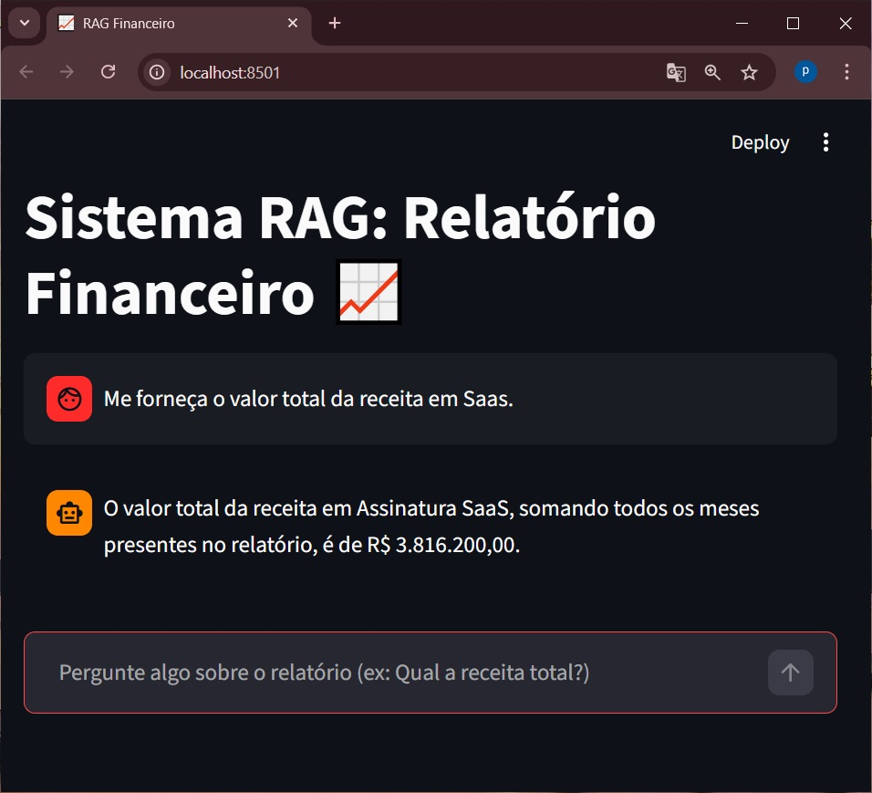

# RAG Financeiro 📈

**🚀 Aplicação ao Vivo:** [Teste o Agente no Hugging Face Spaces]

(https://huggingface.co/spaces/Prof-Saulo-Santos/agent-financ-gemini)


Um sistema interativo de **Retrieval-Augmented Generation (RAG)** construído com Streamlit, LangChain e LLM Gemini (Google) para análise avançada de Relatórios Financeiros em PDF.



## 📋 Sobre o Projeto

Este projeto permite que usuários façam perguntas em linguagem natural sobre um relatório financeiro em PDF. A aplicação utiliza o poder do banco de dados vetorial FAISS e embeddings locais (HuggingFace) para ler e extrair os blocos de texto mais relevantes (`retriever`). Esses blocos são então enviados à LLM (Google Gemini 2.5) para gerar respostas precisas e detalhadas, incluindo cálculos matemáticos.

**Por que essa arquitetura?**
- **Embeddings Locais:** Usei o modelo `all-MiniLM-L6-v2` executando 100% na CPU local (gratuitamente) para criar os vetores de texto.
- **Maior Contexto:** O fragmentador (`chunk_size`) foi calibrado para pegar blocos amplos do relatório, permitindo que a inteligência artificial enxergue tabelas inteiras na hora de somar meses ou analisar categorias.
- **Velocidade:** Ferramentas orquestradas pela LangChain Expression Language (LCEL).

## 🚀 Tecnologias Utilizadas

- **Python 3.13+** (gerenciado com `uv`)
- **Streamlit**: Para a interface visual de Chat.
- **LangChain**: Para orquestração do pipeline RAG.
- **Google Generative AI (Gemini 2.5 Flash)**: LLM responsável pela geração de respostas.
- **HuggingFace & SentenceTransformers**: Geração de embeddings.
- **FAISS**: Banco de dados vetorial em memória para busca semântica rápida (`k=15`).
- **Pre-commit**: Ferramenta de auditoria contínua conectada ao Git para evitar o vazamento de arquivos e chaves secretas.

## ⚙️ Como Executar o Projeto

Siga os passos abaixo para configurar e executar a aplicação na sua máquina:

### 1. Clonar e Inicializar o Ambiente

Como o projeto utiliza o `uv`.
```bash
# Entre na pasta do projeto
cd finance-rag

# Instale todas as dependências do projeto
uv sync
```

### 2. Configurar a Chave de API

O projeto utiliza o modelo gratuito Gemini. Crie um arquivo chamado `.env` na raiz da pasta `finance-rag` e insira a sua chave do Google AI Studio:

*(Dica: O `pre-commit` que configuramos anteriormente já verificará se o `.env` está vazando antes de qualquer upload!)*
```env
# Arquivo .env
GOOGLE_API_KEY=AIzaSy...sua_chave_aqui...
```

### 3. Ingestão de Dados (Processar o PDF)

Antes de fazer perguntas, o sistema precisa ler o PDF e criar o Banco de Dados Vetorial. Coloque o seu `relatorio-financeiro.pdf` no diretório de dados especificado e rode o script de ingestão:

```bash
uv run python src/ingest.py
```
*Isso gerará uma pasta `faiss_index/` na raiz do projeto com os vetores compilados.*

### 4. Executar a Interface Web

Com a ingestão finalizada, inicie o servidor do Streamlit:

```bash
uv run streamlit run src/app.py
```

O seu navegador padrão deverá abrir automaticamente em `http://localhost:8501` contendo a interface do Chat.

## 🧠 Arquitetura de Software

*   **`src/ingest.py`**: Carrega o PDF via `PyPDFLoader`, divide usando `RecursiveCharacterTextSplitter` e salva o índice invertido do vetor localmente usando FAISS.
*   **`src/app.py`**: Lê o índice vetorial, levanta o contexto das conversas (`st.session_state`) e orquestra prompts para interagir com o modelo da API usando blocos LCEL (`RunnablePassthrough`, `StrOutputParser`).
